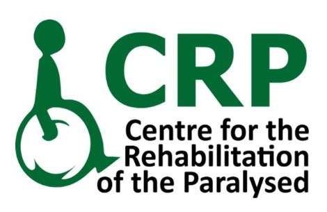

  

  

  <h3 align="center">
    Currently Appointed at <strong>Musculoskeletal Unit, Department of Physiotherapy</strong>
  </h3>

  

    
  

  <h3 align="center">📍Head office, Savar, Dhaka-1343, Bangladesh</h3>

<table align="center">
  <tr>
    <td align="justify" style="max-width:800px; padding:8px; border:none; font-family:'Merriweather'; line-height:1.3;">
      Alongside my clinical responsibilities, I am actively engaged as a <strong>researcher</strong>, focusing on innovative approaches in <strong>rehabilitation and movement science</strong>. My interests include <strong>neurology</strong> and <strong>musculoskeletal conditions</strong>. I actively bridge <strong>healthcare and technology</strong> through <strong>graphic design</strong>, <strong>programming</strong>, and the development of <strong>academic tools</strong> that enhance <strong>rehabilitation</strong> and <strong>education</strong>. Portfolio:
      <a href="https://mahdi-ul-bari.github.io">mahdi-ul-bari.github.io</a>
    </td>
  </tr>
</table>
