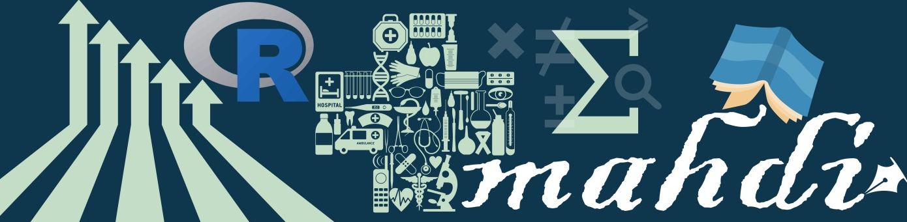

<h1 align="center">
  
</h1>

<h1 align="center">
  
</h1>

  <strong>Currently appointed at <em>Musculoskeletal Unit</em>, Department of Physiotherapy, CRP-Savar, Dhaka-1343, Bangladesh.</strong>

Alongside my clinical responsibilities, I am actively engaged as a <strong>researcher</strong>, focusing on innovative approaches and discoveries in <strong>rehabilitation and movement science</strong>.
My research interests include <strong>neurology</strong> and <strong>musculoskeletal conditions</strong>. I’m passionate about <strong>bridging healthcare and technology</strong> through <strong>graphic design</strong>, <strong>programming</strong>, and developing <strong>academic tools</strong> that would enhance both <strong>rehabilitation</strong> and <strong>education</strong>.

<h3 align="center">
  
    <a href="https://mahdi-ul-bari.github.io"> My Portfolio</a>
  
</h3>
